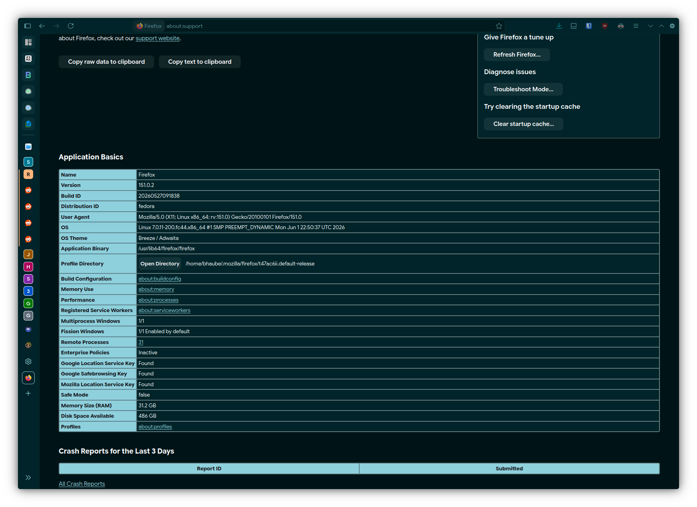

    

    
    
    

# Firefox CSS

I have always written my own Firefox themes to match the system colors I am using at any given time. Right now I use the KDE Plasma DE with the [KDE-Material-You-Colors](https://github.com/luisbocanegra/kde-material-you-colors) package and set the color I want manually instead of using the automatic wallpaper feature.

Anyway, for the first time I wrote some `userContent.ccs` to match all of the `about:*` pages with my themes. I have several themes listed in the "store" under my [Mozilla Developer account](https://addons.mozilla.org/en-US/firefox/user/17796929/) and some others that are signed by Mozilla but not listed. If you want the link to get those you can DM me. 

## My Themes

| Theme                    | Add-on ID                              | Link                                                                                                         |
| :----------------------- | :------------------------------------- | :----------------------------------------------------------------------------------------------------------- |
| Material Dark Forest     | {84a237dc-7559-4934-b750-ea8beb15df7a} | [&darr;&nbsp;Download&nbsp;&darr;](https://addons.mozilla.org/en-US/firefox/addon/material-dark-forest/)     |
| Material Purple Enhanced | {88708e01-e476-4e5e-b56e-f1b998b54189} | [&darr;&nbsp;Download&nbsp;&darr;](https://addons.mozilla.org/en-US/firefox/addon/material-purple-enhanced/) |
| Material Navy Blue       | {dc0110a2-05ed-4f3b-870e-b60d9a415016} | [&darr;&nbsp;Download&nbsp;&darr;](https://addons.mozilla.org/en-US/firefox/addon/material-navy-blue/)       |
| Breeze Light             | {208408d5-228a-450c-879a-d9fc96797800} | [&darr;&nbsp;Download&nbsp;&darr;](https://addons.mozilla.org/en-US/firefox/addon/breeze-light-firefox/)     |
| Breeze Dark              | {3333da79-3641-4ad7-beeb-19d81558d166} | [&darr;&nbsp;Download&nbsp;&darr;](https://addons.mozilla.org/en-US/firefox/addon/kde_breeze_dark_theme/)    |

## System Configuration

| Property         | Value                        |
| :--------------- | :--------------------------- |
| Operating System | Fedora 44 KDE Plasma Edition |
| Kernel Version   | `7.0.11-200.fc44.x86_64`     |
| Firefox Version  | `151.0.3` *(64-bit)*         |
| Firefox Build    | `20260527091838`             |

> [!note]
> I have noticed that some desktop environments, like GNOME and Xfce, tend to force their own native appearance for text input and search boxes, overriding the custom CSS. If this happens in your case you can uncomment the line, `appearance: none !important;`. I do not have a Windows installation to test, but I have had a Windows 10 user report that it works on thier machine. However, YMMV.

## Theme Setup

1. Enable CSS customization in `about:config`: 
    + Open a new tab, and navigate to the `about:config` page via the address bar.
    + Click "Accept the Risk and Continue" if it appears.
    + Search for `toolkit.legacyUserProfileCustomizations.stylesheets` and toggle it to `true` by double-clicking it or using the button on the right side.
2. Locate and open your profile folder:
    + Go to FF Menu &rarr; Help &rarr; 'More Troubleshooting Information' or navigate to `about:support` in your address bar.
    + Under 'Application Basics', click the 'Open Folder' *('Show in Finder' on MacOS)* button next to 'Profile folder'. You should now see your profile folder open in your file manager.

> [!note]
> For Thunderbird, the menu choice is TB Menu &rarr; Help &rarr; 'Troubleshooting Information'.

3. Create the folder and its files:
    + Inside your profile folder, create a new folder named 'chrome' *(case-insensitve)*.
    + Move the files into the 'chrome' folder: `userChrome.css` and `userContent.css` *(case sensitive)*.
4. Restart the application *(three options)*:
    + Close and restart the application the way you normally would.
    + Go to `about:profiles` and click the 'Restart normally...' button.
    + Go to `about:restartrequired` and click the 'Restart Firefox' button.

> [!note]
> For Thunderbird, close and restart the application the way you normally would, or go to TB Menu &rarr; Help Troubleshooting Information &rarr; click `about:profiles` link near the bottom of the 'Application Basics' section &rarr; click the 'Restart normally' button